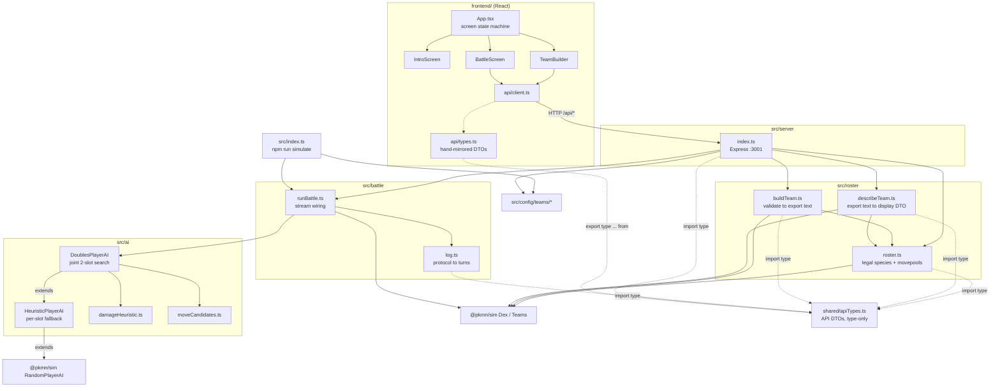

# Architecture

Machine-oriented reference for agents working in this repo. Describes the
module graph, data contracts, and the invariants that are easy to break.
For how to run the project, see [README.md](README.md).

## 1. What this is

A Gen 9 **doubles** auto-battler built on [`@pkmn/sim`](https://github.com/pkmn/ps),
the real Pokémon Showdown simulator engine. The player builds a two-Pokémon,
level-13 team restricted to species obtainable in FireRed/LeafGreen before
Brock; both sides are then played by a heuristic AI and the battle runs to
completion with no human input. The frontend replays the resulting log.

Battles are **persisted** to a libSQL/SQLite database and attributed to a
trainer, who signs in with a username plus three ordered Pokémon instead of a
password (§12). The battle itself is still computed synchronously and returned
whole; storage happens inside the same request.

## 2. Two npm projects, one repo

| | Root (`/`) | `frontend/` |
|---|---|---|
| Role | Simulation engine + Express API | Vite + React UI |
| Runtime | Node, ESM, run via `tsx` (no build step) | Vite dev server / `vite build` |
| Module system | `NodeNext` — **relative imports must carry the `.js` extension** | bundler resolution, no extensions |
| Test runner | `node:test` via `tsx --test` | Vitest + Testing Library + jsdom |
| Lint | none | oxlint |
| TS | `strict` + `noUncheckedIndexedAccess` | `strict` |

They have **separate `package.json` and `package-lock.json`**. `npm install` at
the root does not install the frontend's dependencies; `npm run dev` uses
`concurrently` to run both, and `npm run client` shells out with `--prefix frontend`.

A third, tiny piece sits above both: `shared/apiTypes.ts` at the repo root —
the single source of truth for every `/api/*` request/response DTO, imported
`type`-only by both sides (see §5, §7). It has no runtime code and is fully
erased at transpile time, so it doesn't change either project's runtime
module-resolution story — only their type-checking one.

`noUncheckedIndexedAccess` is on at the root, which is why backend code is full
of `arr[i]!` and `?? fallback` around index reads. Preserve that style; do not
"clean up" the non-null assertions into unchecked reads.

## 3. Module graph



`@pkmn/sim` is the single source of truth for all Pokémon data — species,
types, learnsets, type chart, damage mechanics. There is deliberately **no**
separate dex package and **no** hand-maintained stat/move tables. PokeAPI is
used only by the offline script in §8, never at runtime.

## 4. Request flows

### `GET /api/roster` — what the player may pick
`roster.ts` is the rules engine for legality. It starts from a hardcoded
`BASE_SPECIES` list of ten base species, then for each one:

1. `evoChainStageIds` walks the evolution line, keeping only stages reachable
   by **plain level-up evolution at or below `LEVEL_CAP` (13)**. No stones, no
   trades, no friendship — those items aren't obtainable pre-Brock.
2. `referenceGenForLine` picks the newest generation ≤ 9 that actually has
   level-up data for the line. Gen 9 is the target, but Pidgey, Rattata,
   Spearow, and the Caterpie/Weedle lines are absent from Paldea's dex and so
   have no gen-9 learnset; those fall back to gen 8. **This fallback is
   deliberate and test-covered** — do not hardcode `9`.
3. `legalMovesForStage` collects moves whose source matches `<gen>L<level>`
   with `level <= 13`, accumulating across *earlier* stages too (evolving never
   forgets moves). Only `L` (level-up) sources count — no egg, TM/HM, or tutor
   moves.

The result is memoised in `cachedRoster` for process lifetime. It is pure and
deterministic, so cache invalidation is a non-issue — but it also means
changing `BASE_SPECIES` or `LEVEL_CAP` requires a server restart.

`exclusiveGroup: 'starter'` on the Bulbasaur/Charmander/Squirtle lines encodes
"you can only ever own one starter." It is enforced in three places (server
validation, builder UI disabling, import parsing) and must stay consistent.

### `POST /api/battle` — the main path

```
TeamBuilder state          buildPlayerTeamConfig()        runBattle()
{stageId, moves[]}[2]  ->  validate + emit Showdown   ->  BattleStreams
                           export text (TeamConfig)       + 2x DoublesPlayerAI
                                                              |
BattleScreen replay    <-  {turns, winner, tie,        <-  collectOmniscientLog
                            player, rival}
```

Note the **export-text bottleneck**: the canonical interchange format between
team building and simulation is Pokémon Showdown export text (`TeamConfig
{label, exportText}`), not a structured object. `describeTeam` parses it *back*
into display DTOs rather than threading a parallel structure through. Keep it
that way — it's what lets a pasted Showdown team and a UI-built team take the
identical path.

### `POST /api/import-team` — pasted Showdown text
`parseImportedTeam` normalises names to IDs, rejects items and wrong levels,
then **calls `buildPlayerTeamConfig` for the real validation** rather than
duplicating rules. This is the reason the two entry points cannot drift on what
counts as legal. Preserve that delegation.

## 5. The AI layer

Two classes, one inheritance chain, both extending `@pkmn/sim`'s
`RandomPlayerAI` — which is reused (not `BattlePlayer` directly) for its
already-correct handling of disabled moves, forced switches, team preview, and
doubles choice-string formatting.

**`HeuristicPlayerAI`** — per-slot baseline. Scores each legal move/target as
`basePower × STAB × typeEffectiveness`, and delegates status moves to
`bestStatusHit` (below). It also tracks opponent state (`foeSpecies`,
`foeFainted`, `foeHealth`, `foeStatus`, `foeBoosts`/`ownBoosts`) by
**regex-parsing protocol lines** in `receiveLine`, not by reading engine
internals — the AI only ever knows what a real client would.

**`DoublesPlayerAI`** — the one actually wired into `runBattle` for both sides.
It does a joint search over both active slots' move×target combinations
(`slotA.length × slotB.length`), which lets it focus-fire a KO neither slot
could get alone, value spread moves correctly (`×0.75`, matching the engine's
multi-target modifier), and treat `allAdjacent` friendly fire on its own ally
as a **cost** rather than a benefit. `finishingWeight` divides score by target
HP fraction as a proxy for "finish off the weakened one" — there is no real
damage calculator here, and it does not claim to predict actual damage.

### Status-move weighting

Status moves are **not** pinned below every attack. That made the matchups this
format keeps producing look unwinnable: a Spearow (Normal/Flying) into Geodude
+ Onix (both Rock/Ground) has no attack that isn't resisted, and chipping is
strictly worse than dropping both foes' Attack with one Growl. So
`bestStatusHit` scores the modeled families — stat-stage changes (`move.boosts`)
and non-volatile status (`move.status`) — in the **same units as damage**,
anchored on `STAT_STAGE_VALUE`, and lets the ordinary `bestHit` ranking decide.
Four things keep it from degenerating into status-spam:

- **Per live foe.** A spread debuff (`allAdjacentFoes`: Growl, Leer, Tail Whip)
  is counted once per live foe and takes **no** `SPREAD_MODIFIER` — unlike
  spread damage, the engine doesn't weaken it. That two-for-one is most of why
  it beats an attack in doubles.
- **Diminishing returns**, off the tracked `foeBoosts`/`ownBoosts`: each stage
  already stacked in the same direction discounts the next by
  `STAGE_DIMINISHING`, clamped at the ±6 cap. Directional, so stripping a stage
  off a *boosted* foe is still worth full price.
- **HP scaling.** A debuff only pays off over the turns the target is still
  around to act, so it's worth little against a nearly-fainted foe — where
  `finishingWeight` is simultaneously pushing the attack up.
- **Can't-land checks**: accuracy, one non-volatile status per foe,
  type-immune ailments (Fire/burn, Electric/paralysis, …), and
  `ignoreImmunity: false` moves like Thunder Wave into a Ground-type.

Anything outside the modeled families (Protect, Substitute, Leech Seed,
confusion, screens, Helping Hand) still falls back to `STATUS_SCORE` = `-1`:
rankable but always last. **These weights are test-pinned** — see the
status-move block in `damageHeuristic.test.ts` plus the end-to-end Spearow
cases in `DoublesPlayerAI.test.ts` / `HeuristicPlayerAI.test.ts`. They exist
because the flat-`-1` behaviour was reported as a bug; don't regress it while
tuning damage numbers.

`tryJointMove` returns `false` to **fall back to the inherited per-slot
heuristic** whenever the situation isn't a clean two-live-slot move turn:
forced switches, team preview, either side down to one mon, unrevealed foes.
Any thrown error also falls back. This fallback path is load-bearing — the
joint search is an optimisation over a correct baseline, not a replacement.

The whole layer is **pure arithmetic**: no battle cloning, no speculative
engine turns, no RNG consumed. It is deterministic and equally cheap for one
battle or a million.

### Attacker identity resolution

`DoublesPlayerAI` maps an active slot to its Pokémon by **array position in
`ownTeam`** (`this.ownTeam.map(...)`, indexed by slot) — safe because
`tryJointMove` only ever runs while *both* slots are confirmed alive
(`foeFainted`/own-side fainted checks bail out to the per-slot fallback
otherwise, see below), and slot position never changes for a fixed
two-Pokémon team with no bench.

`HeuristicPlayerAI.chooseMove` cannot use plain array position, because
`@pkmn/sim`'s own request-dispatch loop (`random-player-ai.mjs`) only invokes
`chooseMove` for *live* active slots — a fainted slot gets an implicit
`'pass'` with no call at all. A naive per-call counter into `ownTeam` (what
this code used to do) desyncs from the true slot index the first time an
*earlier* slot is the one that faints: the next `chooseMove` call is for the
surviving later slot, but the counter is back at 0, silently attributing that
slot's moves to the wrong team member's species/types for the rest of the
battle (wrong STAB, wrong effectiveness). Fixed by precomputing, in
`receiveRequest`, the correctly-ordered subsequence of `ownTeam` members that
`chooseMove` will actually be called for — filtering out fainted slots using
the same `condition` check the engine itself uses — rather than trusting a
counter to line up with slot index. See `HeuristicPlayerAI.test.ts` for the
regression case (one slot fainted, the survivor must still score STAB off its
own species, not the fainted slot's).

## 6. Protocol log handling

`collectOmniscientLog` consumes the **omniscient** stream (sees both sides) and
groups raw protocol lines into `{turn, lines[]}` buckets on `|turn|N`, stripping
only the leading `|`. Everything before turn 1 lands in a synthetic `turn: 0`
bucket. `|win|` and `|tie|` are captured *and* kept in the lines.

The log stays close to raw protocol on purpose — `@pkmn/protocol` is the
documented upgrade path for humanised text and is intentionally not installed.
Consequences downstream: `BattleScreen` re-parses those strings with its own
regex (`^faint\|(p1|p2)[ab]: (.+)$`) for the faint indicators, and matches
`fainted` Pokémon by **display name**.

Win/tie detection, by contrast, is **not** left to the frontend. `log.ts`'s
`winner` field is just the raw protocol name (`|win|<name>`) — it doesn't know
"player" vs "rival", only p1/p2 identity, which is the right level of
knowledge for that layer. `src/server/index.ts`'s `/api/battle` handler is
where player/rival identity is actually known (`team` is always the player,
`rivalTeam` always the rival), so it computes an explicit `outcome: 'player' |
'rival' | 'tie'` there and puts it on the API response
(`BattleApiResponse`, `shared/apiTypes.ts`). `BattleScreen` just switches on
`result.outcome` — it never compares `winner` to a label itself. Keep new
win/tie logic in that one place; don't reintroduce a label-string comparison
in the frontend.

`turn: 0` also means `maxTurn = turns.length - 1` in `BattleScreen` counts
buckets, not game turns; the replay controls index buckets.

## 7. Frontend

`App.tsx` is a three-state screen machine (`intro → build → battle`) holding
the only cross-screen state: the chosen `PlayerPokemonSelection[]`. No router,
no state library. The one context in the tree is `LanguageProvider` (see the
i18n bullet below), wrapped around `<App />` in `main.tsx`.

- **`TeamBuilder`** holds a fixed `[SlotState, SlotState]` tuple. Changing
  species resets stage and moves; changing stage resets moves. It re-implements
  the starter-exclusivity check client-side for immediate feedback and to
  disable buttons — the server check in `buildPlayerTeamConfig` remains
  authoritative.
- **`BattleScreen`** fetches the *entire* battle on mount, then reveals turn
  buckets on a 900 ms timer with pause / next / skip controls. The battle is
  already fully decided before the first line renders; the replay is pure
  presentation.
- **`api/types.ts` is a thin re-export barrel** over `shared/apiTypes.ts` —
  `export type { ... } from '../../../shared/apiTypes'`. There is no separate
  npm package or codegen step; the shared file is reachable by a plain
  relative path because `frontend/` is a subdirectory of the repo root, and
  the import is fully type-only so it has zero runtime/bundling cost (see
  §5). Backend response handlers in `src/server/index.ts` are explicitly
  type-annotated against the same shared types, so a shape mismatch between
  what a route returns and what the frontend expects is now a **compile
  error**, not a silent runtime drift. Add new DTOs to `shared/apiTypes.ts`
  directly rather than declaring them in only one side.
- Sprites come from the PokeAPI sprite CDN by national dex number
  (`spriteUrl`), the one runtime external dependency. It has no fallback; if
  the CDN is unreachable, images just fail to load.
- Vite dev-proxies `/api` to `:3001`, so the client uses same-origin relative
  paths and there is no CORS setup. A production deployment must reproduce that
  proxying — nothing in the code handles a cross-origin API. See DEPLOYMENT.md
  for the Firebase Hosting rewrite that does so.
- Those relative paths are **prefixed, not literal**. `client.ts` derives
  ``const API = `${import.meta.env.BASE_URL}api` `` and every `fetch` hangs off
  it; the server mirrors this with `app.use(BASE_PATH || '/', api)`, where every
  route lives on one `express.Router()` rather than on `app`. Both default to
  root — `BASE_URL` is `/` and `BASE_PATH` is `''` unless `VITE_BASE` /
  `BASE_PATH` are set — so dev behaves exactly as if the prefix did not exist.
  The two must agree: a hardcoded `/api` on either side silently 404s under a
  prefix. Only `express.json()`, `trust proxy` and `session(...)` stay global on
  `app`, so the session cookie keeps path `/` and reaches both origins.
- **`frontend/src/i18n/`** is the English/Spanish translation layer, entirely
  client-side — the backend and `shared/apiTypes.ts` are untouched by it.
  `LanguageContext` holds the active `Lang` (persisted to `localStorage`,
  defaulted from `navigator.language`) and exposes `t(key, vars?)` for the
  UI-chrome strings in `translations.ts`. Dex-derived display text (species,
  move, ability, nature names — plus move/ability short descriptions) is
  translated separately by `dexNames.ts` against `data/esDex.json`, keyed by
  a lowercase-alphanumeric slug of the **English** display name (matching
  `@pkmn/sim`'s `toID`) rather than by the DTO's `id` field — this lets any
  English name string arriving from the API *or* parsed out of a raw battle
  log line (`BattleScreen`'s `Mon` component, move names in `move|` protocol
  lines) be translated the same way, without needing the id alongside it.
  Types, stat names/abbreviations, and move categories are small fixed
  vocabularies hand-translated directly in `dexNames.ts`, not sourced from
  the JSON. `esDex.json` only covers the species/moves/abilities/natures
  that can actually appear — the full roster (`src/roster/roster.ts`) plus
  Brock's fixed team — and is regenerated by `scripts/generate-es-dex.ts`
  (see §8); it is **not** a general-purpose Pokémon translation table and
  will silently fall back to the English name for anything outside that set
  (e.g. if `BASE_SPECIES` in `roster.ts` ever grows, rerun the script).
  Showdown import/export text (`TeamBuilder`'s import panel) is deliberately
  left untranslated in the placeholder example — the format is always
  English canonical names regardless of UI language, since `buildTeam.ts`
  resolves it through `@pkmn/sim`'s dex, which doesn't recognize localized
  names.

## 8. Offline scripts

`scripts/pokemon-before-brock.ts` queries **PokeAPI** for every FireRed/LeafGreen
encounter reachable before the Pewter Gym (Routes 1/2/22, Viridian Forest, walk
encounters only — Surf and fishing come much later) plus the three starters. It
is **not wired into the runtime**; it is the audit trail justifying the
hardcoded `BASE_SPECIES` list in `roster.ts`. Its committed output lives at
`scripts/output/pokemon-before-brock.json`. Re-run it if the eligible-species
list is ever questioned, then update `BASE_SPECIES` by hand.

`scripts/generate-es-dex.ts` queries **PokeAPI** for the official Spanish
names of every species/move/ability the roster and Brock's team can produce
(via `getRoster()`/`getNatures()` and parsing `rivalTeam.exportText` with
`Teams.import`), plus all 25 natures. Also not wired into the runtime; its
committed output, `frontend/src/i18n/data/esDex.json`, is read at build time
by the frontend's translation layer (§7). Re-run it (`npx tsx
scripts/generate-es-dex.ts`) whenever the roster's species/move/ability pool
changes — a new `BASE_SPECIES` entry, a `LEVEL_CAP` change that shifts legal
movepools, or an edit to `rivalTeam` — otherwise new names silently render
in English for Spanish players instead of erroring.

## 9. Invariants worth protecting

1. **`@pkmn/sim` is the only Pokémon data source at runtime.** Do not add a dex
   package or hand-written tables.
2. **`buildPlayerTeamConfig` is the single legality gate.** Both the structured
   and the pasted-text entry points must route through it.
3. **Backend relative imports end in `.js`** (`NodeNext`), even from `.ts`.
4. **API DTOs live once, in `shared/apiTypes.ts`.** Add or change a
   request/response shape there, and don't declare a competing shape on either
   side. Note that `frontend/src/api/types.ts` is an **explicit named re-export
   list**, not a wildcard — a new DTO must be added there too or the frontend
   cannot import it.
5. **The AI reads only public protocol information.** Do not reach into engine
   internals for hidden movesets or exact HP.
6. **`DoublesPlayerAI` must always be able to fall back** to the inherited
   per-slot logic; keep `tryJointMove` total and non-throwing at the call site.
7. **`LEVEL_CAP` and `FORMAT_ID` are exported from `roster.ts`** and imported
   everywhere else. Never re-declare `13` or `'gen9doublescustomgame'` locally.
8. **Everything written to the database is English or a dex id** (§12).
   Normalise through the dex at the write boundary; the i18n layer is
   client-side and must never reach storage.
9. **`roster.ts` and `nationalDex.ts` stay decoupled.** The battle roster and
   the login species pool answer different questions; changing one must not
   invalidate the other.
10. **An effect that runs a battle must run exactly once per team** (§12).
    A battle is now a database write, so a re-run corrupts the stats corpus.

## 10. Testing

`npm test` runs `tsx --test src/**/*.test.ts` (51 tests) covering roster
generation, team validation/import, damage heuristics, move-candidate
derivation, the doubles joint search, per-slot attacker-identity resolution,
protocol-log turn bucketing, `describeTeam`, faint detection, and the national
dex list. `npm --prefix frontend run test` runs Vitest against `TeamBuilder`
(3 tests). Both suites pass as of this document.

Coverage gaps to be aware of: `runBattle`, the Express handlers, and
`BattleScreen` still have no direct tests — exercising those needs a real (or
mocked) HTTP server / DOM, a larger investment than the currently-tested pure
functions required. The same applies to everything database-backed
(`persistBattle`, the auth routes, `LibsqlSessionStore`): there is no test-DB
fixture infrastructure, so those were verified by driving the running app
(§10, manual UI verification) and inspecting rows, not by automated tests.

The root test glob relies on shell expansion; because every test file sits
exactly one directory below `src/`, `src/**/*.test.ts` resolves correctly even
under a shell without `globstar`. A test placed at `src/foo.test.ts` or nested
two levels deep would be silently skipped.

### Manual UI verification (no browser test harness)

There is no automated browser/E2E suite — `TeamBuilder.test.tsx` covers
component logic against a mocked `fetchRoster`/`importTeam`, not a rendered
page in a real browser. Neither project depends on Playwright or any other
browser driver, and none is preinstalled in this environment.

To visually verify a UI change against the running app (screenshot proof, not
just passing tests), drive it ad hoc with Playwright rather than adding it as
a project dependency:

1. Install into an isolated scratch directory, **not** `frontend/` — this
   avoids touching either `package.json`/lockfile for a one-off check:
   `npm init -y && npm install playwright --no-save && npx playwright install
   chromium`.
2. Start both servers with `npm run dev` (API `:3001`, Vite `:5173` via
   `concurrently`) and poll the port instead of sleeping a fixed duration.
3. Drive with a short Node script: `chromium.launch()` → `page.goto('http://
   localhost:5173')` → interact → `page.screenshot()`. Register
   `page.on('console')` (filter `type() === 'error'`) and `page.on('pageerror')`
   listeners up front — a page can render its shell while a data fetch or a
   component throws silently underneath.
4. Kill the dev servers by port when done —
   `lsof -ti:5173,3001 -sTCP:LISTEN | xargs -r kill` — not a broad `pkill -f`,
   which risks matching unrelated processes.

This is a one-off verification workflow, not a checked-in test; nothing here
implies Playwright should be added to either `package.json`.

## 11. Known duplication

- `src/config/teams/player.ts` is explicitly a **placeholder** with an
  unresearched moveset, used only by `npm run simulate`. This is intentional,
  not an oversight — swap it out if a real player fixture is ever needed for
  the CLI path.

## 12. Persistence and accounts

### Storage engine

One engine for both environments: **libSQL** via `@libsql/client` (`src/db/pool.ts`).
Local dev is a plain `file:./local.db` — nothing to install or start, created by
the first `npm run migrate`; production points the identical client at a
Turso-hosted `libsql://` URL. Same dialect both places, so there is no
per-environment compatibility layer and no ORM: queries are hand-written
parameterized SQL with `?` placeholders.

Schema changes are `.sql` files under `src/db/migrations/`, applied by
`npm run migrate` (`src/db/migrate.ts`) and recorded in `schema_migrations`.
The runner uses `executeMultiple`, which is **not** transactional, so every
migration is written with `CREATE ... IF NOT EXISTS` and is safe to re-run.

### What a battle stores

`POST /api/battle` writes inside the same request that runs the battle, just
before responding (`src/db/persistBattle.ts`, one transaction):

- `battles` — one row: the trainer, both team labels, the `outcome`, and a
  precomputed `player_team_key` (sorted, `+`-joined species ids).
- `battle_pokemon` — one row per Pokémon per side: species, level, ability,
  nature, moves, and whether it `fainted`. Rival rows carry `user_id = NULL`.

A persistence failure is logged and swallowed: the battle already ran, and
losing a stats row is not worth turning a finished battle into an error screen.

**Everything stored is English or a dex id.** The two sides arrive in different
formats — player selections carry ids (`growl`), a rival's export text carries
display names (`Defense Curl`) — so `persistBattle` normalises both through the
dex before writing. Skipping that would split every future `GROUP BY` on a move
or ability in half. Display names (`Bulbasaur`) come from `@pkmn/sim` and are
always English canonical; the i18n layer is client-side only (§7) and never
reaches the database. Verified by playing a battle in the Spanish UI and
confirming the rows are identical to an English one.

The shape exists to serve statistics that are **not built yet** — team tier
lists, per-species tier lists, per-trainer winrate, and which trainer favours
which species. Each is a plain `GROUP BY` off an existing index:
`player_team_key` avoids reconstructing team identity per query, and
`battle_pokemon.user_id` is denormalised from `battles` so per-trainer species
usage needs no join.

Fainted-per-Pokémon is derived by `detectFaints` (`src/battle/faints.ts`), which
re-parses the same `faint|p1a: Name` protocol lines `BattleScreen` uses (§6) and
matches **by display name**. `runBattle` always assigns p1 to the player team
and p2 to the rival, so that mapping needs no label comparison — unlike
win/tie detection, which does.

### Accounts

Login is required: unauthenticated users reach only `/api/species` and the
`/api/auth/*` routes. Everything registered after `app.use(requireAuth)` in
`src/server/index.ts` is gated, which is deliberately the default for routes
added later.

The credential is a username plus **three ordered Pokémon** and a display name —
no password, and the combo is stored in plaintext. That is a considered choice,
not an oversight: hashing defends against a *reused, meaningful* secret leaking,
and a fictional trio guards nothing and is reused nowhere. Treat it as a login
gate, not an authentication boundary. Signup and login are one route
(`POST /api/auth/login`): an unclaimed username takes the combo it was submitted
with, a claimed one must match positionally.

The dropdowns come from `src/roster/nationalDex.ts`, which is **separate from
`roster.ts` on purpose**. `roster.ts` answers "what may the player battle with"
(pre-Brock, level-13 legal, ~10 species); this answers "what may the player
identify as" (all 1025). Coupling them would mean editing the battle roster
could invalidate someone's login. It keeps `isNonstandard: 'Past'` species,
without which a Pokémon picker could not pick Pidgey.

Staying signed in is belt-and-braces, because the combo is not a real secret:
a 400-day `rolling` session cookie (the browser-enforced ceiling, slid forward
on every request via the session store's `touch`), backed by the credentials
cached in `localStorage`. If the cookie is ever gone, `AuthContext` silently
replays the cache and the trainer never sees the form. **Only an explicit logout
ends that**, which is why `logout()` must clear `localStorage` as well as the
server session — otherwise the next page load signs them straight back in.

Sessions live in the same database via `src/auth/LibsqlSessionStore.ts`, a small
hand-written `express-session` store (`connect-pg-simple` and friends are
Postgres-only). Its `touch` is load-bearing: `rolling: true` relies on it.

### Effects that run battles must run once

Running a battle is a database write, so anything that can trigger one twice
corrupts the stats corpus with a battle nobody played. Two guards exist, and
both are load-bearing:

1. **`BattleScreen`'s battle effect** is guarded by a ref and deliberately
   excludes `t` from its dependencies. `StrictMode` double-invokes effects in
   dev, and `t`'s identity changes with the language, so an unguarded effect
   re-runs on a mid-battle language switch — in production too.
2. **`App` resets `screen` and `selections` whenever `user` goes null.** Screen
   state otherwise outlives the session: logging out from the battle screen and
   back in would remount `BattleScreen` — with a fresh ref, so guard (1) does
   not help — and replay the previous team as a new battle. It keys on `user`
   rather than the logout click so an expired session or a different trainer
   signing in resets it too.

Any future effect that can start a battle needs the same care, and the test for
it is behavioural: play one battle, then count rows.
