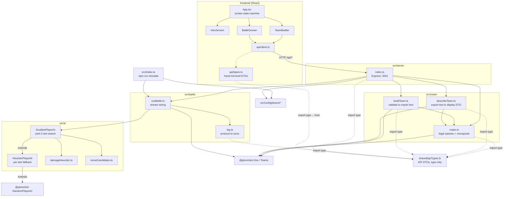

# Architecture

Machine-oriented reference for agents working in this repo. Describes the
module graph, data contracts, and the invariants that are easy to break.
For how to run the project, see [README.md](README.md).

## 1. What this is

A Gen 9 **doubles** auto-battler built on [`@pkmn/sim`](https://github.com/pkmn/ps),
the real Pokémon Showdown simulator engine. The player builds a two-Pokémon,
level-13 team restricted to species obtainable in FireRed/LeafGreen before
Brock; both sides are then played by a heuristic AI and the battle runs to
completion with no human input. The frontend replays the resulting log.

There is **no persistence layer**. No database, no sessions, no auth. Every
request is stateless; a battle is computed synchronously and returned whole.

## 2. Two npm projects, one repo

| | Root (`/`) | `frontend/` |
|---|---|---|
| Role | Simulation engine + Express API | Vite + React UI |
| Runtime | Node, ESM, run via `tsx` (no build step) | Vite dev server / `vite build` |
| Module system | `NodeNext` — **relative imports must carry the `.js` extension** | bundler resolution, no extensions |
| Test runner | `node:test` via `tsx --test` | Vitest + Testing Library + jsdom |
| Lint | none | oxlint |
| TS | `strict` + `noUncheckedIndexedAccess` | `strict` |

They have **separate `package.json` and `package-lock.json`**. `npm install` at
the root does not install the frontend's dependencies; `npm run dev` uses
`concurrently` to run both, and `npm run client` shells out with `--prefix frontend`.

A third, tiny piece sits above both: `shared/apiTypes.ts` at the repo root —
the single source of truth for every `/api/*` request/response DTO, imported
`type`-only by both sides (see §5, §7). It has no runtime code and is fully
erased at transpile time, so it doesn't change either project's runtime
module-resolution story — only their type-checking one.

`noUncheckedIndexedAccess` is on at the root, which is why backend code is full
of `arr[i]!` and `?? fallback` around index reads. Preserve that style; do not
"clean up" the non-null assertions into unchecked reads.

## 3. Module graph



`@pkmn/sim` is the single source of truth for all Pokémon data — species,
types, learnsets, type chart, damage mechanics. There is deliberately **no**
separate dex package and **no** hand-maintained stat/move tables. PokeAPI is
used only by the offline script in §8, never at runtime.

## 4. Request flows

### `GET /api/roster` — what the player may pick
`roster.ts` is the rules engine for legality. It starts from a hardcoded
`BASE_SPECIES` list of ten base species, then for each one:

1. `evoChainStageIds` walks the evolution line, keeping only stages reachable
   by **plain level-up evolution at or below `LEVEL_CAP` (13)**. No stones, no
   trades, no friendship — those items aren't obtainable pre-Brock.
2. `referenceGenForLine` picks the newest generation ≤ 9 that actually has
   level-up data for the line. Gen 9 is the target, but Pidgey, Rattata,
   Spearow, and the Caterpie/Weedle lines are absent from Paldea's dex and so
   have no gen-9 learnset; those fall back to gen 8. **This fallback is
   deliberate and test-covered** — do not hardcode `9`.
3. `legalMovesForStage` collects moves whose source matches `<gen>L<level>`
   with `level <= 13`, accumulating across *earlier* stages too (evolving never
   forgets moves). Only `L` (level-up) sources count — no egg, TM/HM, or tutor
   moves.

The result is memoised in `cachedRoster` for process lifetime. It is pure and
deterministic, so cache invalidation is a non-issue — but it also means
changing `BASE_SPECIES` or `LEVEL_CAP` requires a server restart.

`exclusiveGroup: 'starter'` on the Bulbasaur/Charmander/Squirtle lines encodes
"you can only ever own one starter." It is enforced in three places (server
validation, builder UI disabling, import parsing) and must stay consistent.

### `POST /api/battle` — the main path

```
TeamBuilder state          buildPlayerTeamConfig()        runBattle()
{stageId, moves[]}[2]  ->  validate + emit Showdown   ->  BattleStreams
                           export text (TeamConfig)       + 2x DoublesPlayerAI
                                                              |
BattleScreen replay    <-  {turns, winner, tie,        <-  collectOmniscientLog
                            player, rival}
```

Note the **export-text bottleneck**: the canonical interchange format between
team building and simulation is Pokémon Showdown export text (`TeamConfig
{label, exportText}`), not a structured object. `describeTeam` parses it *back*
into display DTOs rather than threading a parallel structure through. Keep it
that way — it's what lets a pasted Showdown team and a UI-built team take the
identical path.

### `POST /api/import-team` — pasted Showdown text
`parseImportedTeam` normalises names to IDs, rejects items and wrong levels,
then **calls `buildPlayerTeamConfig` for the real validation** rather than
duplicating rules. This is the reason the two entry points cannot drift on what
counts as legal. Preserve that delegation.

## 5. The AI layer

Two classes, one inheritance chain, both extending `@pkmn/sim`'s
`RandomPlayerAI` — which is reused (not `BattlePlayer` directly) for its
already-correct handling of disabled moves, forced switches, team preview, and
doubles choice-string formatting.

**`HeuristicPlayerAI`** — per-slot baseline. Scores each legal move/target as
`basePower × STAB × typeEffectiveness`, status moves at a constant `-1` so
they rank last but stay selectable. It also tracks opponent state
(`foeSpecies`, `foeFainted`, `foeHealth`) by **regex-parsing protocol lines** in
`receiveLine`, not by reading engine internals — the AI only ever knows what a
real client would.

**`DoublesPlayerAI`** — the one actually wired into `runBattle` for both sides.
It does a joint search over both active slots' move×target combinations
(`slotA.length × slotB.length`), which lets it focus-fire a KO neither slot
could get alone, value spread moves correctly (`×0.75`, matching the engine's
multi-target modifier), and treat `allAdjacent` friendly fire on its own ally
as a **cost** rather than a benefit. `finishingWeight` divides score by target
HP fraction as a proxy for "finish off the weakened one" — there is no real
damage calculator here, and it does not claim to predict actual damage.

`tryJointMove` returns `false` to **fall back to the inherited per-slot
heuristic** whenever the situation isn't a clean two-live-slot move turn:
forced switches, team preview, either side down to one mon, unrevealed foes.
Any thrown error also falls back. This fallback path is load-bearing — the
joint search is an optimisation over a correct baseline, not a replacement.

The whole layer is **pure arithmetic**: no battle cloning, no speculative
engine turns, no RNG consumed. It is deterministic and equally cheap for one
battle or a million.

### Attacker identity resolution

`DoublesPlayerAI` maps an active slot to its Pokémon by **array position in
`ownTeam`** (`this.ownTeam.map(...)`, indexed by slot) — safe because
`tryJointMove` only ever runs while *both* slots are confirmed alive
(`foeFainted`/own-side fainted checks bail out to the per-slot fallback
otherwise, see below), and slot position never changes for a fixed
two-Pokémon team with no bench.

`HeuristicPlayerAI.chooseMove` cannot use plain array position, because
`@pkmn/sim`'s own request-dispatch loop (`random-player-ai.mjs`) only invokes
`chooseMove` for *live* active slots — a fainted slot gets an implicit
`'pass'` with no call at all. A naive per-call counter into `ownTeam` (what
this code used to do) desyncs from the true slot index the first time an
*earlier* slot is the one that faints: the next `chooseMove` call is for the
surviving later slot, but the counter is back at 0, silently attributing that
slot's moves to the wrong team member's species/types for the rest of the
battle (wrong STAB, wrong effectiveness). Fixed by precomputing, in
`receiveRequest`, the correctly-ordered subsequence of `ownTeam` members that
`chooseMove` will actually be called for — filtering out fainted slots using
the same `condition` check the engine itself uses — rather than trusting a
counter to line up with slot index. See `HeuristicPlayerAI.test.ts` for the
regression case (one slot fainted, the survivor must still score STAB off its
own species, not the fainted slot's).

## 6. Protocol log handling

`collectOmniscientLog` consumes the **omniscient** stream (sees both sides) and
groups raw protocol lines into `{turn, lines[]}` buckets on `|turn|N`, stripping
only the leading `|`. Everything before turn 1 lands in a synthetic `turn: 0`
bucket. `|win|` and `|tie|` are captured *and* kept in the lines.

The log stays close to raw protocol on purpose — `@pkmn/protocol` is the
documented upgrade path for humanised text and is intentionally not installed.
Consequences downstream: `BattleScreen` re-parses those strings with its own
regex (`^faint\|(p1|p2)[ab]: (.+)$`) for the faint indicators, and matches
`fainted` Pokémon by **display name**.

Win/tie detection, by contrast, is **not** left to the frontend. `log.ts`'s
`winner` field is just the raw protocol name (`|win|<name>`) — it doesn't know
"player" vs "rival", only p1/p2 identity, which is the right level of
knowledge for that layer. `src/server/index.ts`'s `/api/battle` handler is
where player/rival identity is actually known (`team` is always the player,
`rivalTeam` always the rival), so it computes an explicit `outcome: 'player' |
'rival' | 'tie'` there and puts it on the API response
(`BattleApiResponse`, `shared/apiTypes.ts`). `BattleScreen` just switches on
`result.outcome` — it never compares `winner` to a label itself. Keep new
win/tie logic in that one place; don't reintroduce a label-string comparison
in the frontend.

`turn: 0` also means `maxTurn = turns.length - 1` in `BattleScreen` counts
buckets, not game turns; the replay controls index buckets.

## 7. Frontend

`App.tsx` is a three-state screen machine (`intro → build → battle`) holding
the only cross-screen state: the chosen `PlayerPokemonSelection[]`. No router,
no state library, no context.

- **`TeamBuilder`** holds a fixed `[SlotState, SlotState]` tuple. Changing
  species resets stage and moves; changing stage resets moves. It re-implements
  the starter-exclusivity check client-side for immediate feedback and to
  disable buttons — the server check in `buildPlayerTeamConfig` remains
  authoritative.
- **`BattleScreen`** fetches the *entire* battle on mount, then reveals turn
  buckets on a 900 ms timer with pause / next / skip controls. The battle is
  already fully decided before the first line renders; the replay is pure
  presentation.
- **`api/types.ts` is a thin re-export barrel** over `shared/apiTypes.ts` —
  `export type { ... } from '../../../shared/apiTypes'`. There is no separate
  npm package or codegen step; the shared file is reachable by a plain
  relative path because `frontend/` is a subdirectory of the repo root, and
  the import is fully type-only so it has zero runtime/bundling cost (see
  §5). Backend response handlers in `src/server/index.ts` are explicitly
  type-annotated against the same shared types, so a shape mismatch between
  what a route returns and what the frontend expects is now a **compile
  error**, not a silent runtime drift. Add new DTOs to `shared/apiTypes.ts`
  directly rather than declaring them in only one side.
- Sprites come from the PokeAPI sprite CDN by national dex number
  (`spriteUrl`), the one runtime external dependency. It has no fallback; if
  the CDN is unreachable, images just fail to load.
- Vite dev-proxies `/api` to `:3001`, so the client uses same-origin relative
  paths and there is no CORS setup. A production deployment must reproduce that
  proxying — nothing in the code handles a cross-origin API.

## 8. Offline script

`scripts/pokemon-before-brock.ts` queries **PokeAPI** for every FireRed/LeafGreen
encounter reachable before the Pewter Gym (Routes 1/2/22, Viridian Forest, walk
encounters only — Surf and fishing come much later) plus the three starters. It
is **not wired into the runtime**; it is the audit trail justifying the
hardcoded `BASE_SPECIES` list in `roster.ts`. Its committed output lives at
`scripts/output/pokemon-before-brock.json`. Re-run it if the eligible-species
list is ever questioned, then update `BASE_SPECIES` by hand.

## 9. Invariants worth protecting

1. **`@pkmn/sim` is the only Pokémon data source at runtime.** Do not add a dex
   package or hand-written tables.
2. **`buildPlayerTeamConfig` is the single legality gate.** Both the structured
   and the pasted-text entry points must route through it.
3. **Backend relative imports end in `.js`** (`NodeNext`), even from `.ts`.
4. **API DTOs live once, in `shared/apiTypes.ts`.** Add or change a
   request/response shape there; both the backend route handlers and the
   frontend re-export barrel (`frontend/src/api/types.ts`) pick it up
   automatically. Don't declare a competing shape on either side.
5. **The AI reads only public protocol information.** Do not reach into engine
   internals for hidden movesets or exact HP.
6. **`DoublesPlayerAI` must always be able to fall back** to the inherited
   per-slot logic; keep `tryJointMove` total and non-throwing at the call site.
7. **`LEVEL_CAP` and `FORMAT_ID` are exported from `roster.ts`** and imported
   everywhere else. Never re-declare `13` or `'gen9doublescustomgame'` locally.

## 10. Testing

`npm test` runs `tsx --test src/**/*.test.ts` (39 tests) covering roster
generation, team validation/import, damage heuristics, move-candidate
derivation, the doubles joint search, per-slot attacker-identity resolution,
protocol-log turn bucketing, and `describeTeam`. `npm --prefix frontend run
test` runs Vitest against `TeamBuilder` (3 tests). Both suites pass as of this
document.

Coverage gaps to be aware of: `runBattle`, the Express handlers, and
`BattleScreen` still have no direct tests — exercising those needs a real (or
mocked) HTTP server / DOM, a larger investment than the currently-tested pure
functions required.

The root test glob relies on shell expansion; because every test file sits
exactly one directory below `src/`, `src/**/*.test.ts` resolves correctly even
under a shell without `globstar`. A test placed at `src/foo.test.ts` or nested
two levels deep would be silently skipped.

## 11. Known duplication

- `src/config/teams/player.ts` is explicitly a **placeholder** with an
  unresearched moveset, used only by `npm run simulate`. This is intentional,
  not an oversight — swap it out if a real player fixture is ever needed for
  the CLI path.
