# Architecture

Machine-oriented reference for agents working in this repo. Describes the
module graph, data contracts, and the invariants that are easy to break.
For how to run the project, see [README.md](../README.md).

## 1. What this is

A Gen 9 **doubles** auto-battler built on [`@pkmn/sim`](https://github.com/pkmn/ps),
the real Pokémon Showdown simulator engine. The player picks a gym leader —
Brock, Misty, and Lt. Surge are playable today, five more are reserved slots with no
label/team/art (§3, §9) — and builds a team restricted to species obtainable
in FireRed/LeafGreen before that leader, at that leader's own level cap and
team size (`LeaderRules`, §3, §9 invariant 7); both sides are then played by a
heuristic AI and the battle runs to completion with no human input. The
frontend replays the resulting log.

Battles are **persisted** to a libSQL/SQLite database and attributed to a
trainer, who signs in with a username plus three ordered Pokémon instead of a
password (§12). The battle itself is still computed synchronously and returned
whole; storage happens inside the same request.

Alongside the battle, every move decision either AI made is recorded with the
public state it saw at the time, and players can report on individual decisions
from the replay. That feedback loop exists to iterate on the heuristics in
`src/ai`; it is described in §12.

## 2. Two npm projects, one repo

| | Root (`/`) | `frontend/` |
|---|---|---|
| Role | Simulation engine + Express API | Vite + React UI |
| Runtime | Node, ESM, run via `tsx` (no build step) | Vite dev server / `vite build` |
| Module system | `NodeNext` — **relative imports must carry the `.js` extension** | bundler resolution, no extensions |
| Test runner | `node:test` via `tsx --test` | Vitest + Testing Library + jsdom |
| Lint | none | oxlint |
| TS | `strict` + `noUncheckedIndexedAccess` | `strict` |

They have **separate `package.json` and `package-lock.json`**. `npm install` at
the root does not install the frontend's dependencies; `npm run dev` uses
`concurrently` to run both, and `npm run client` shells out with `--prefix frontend`.

Because there is no build step, **`tsx` is a runtime dependency, not a dev
one** — it is what strips types on the fly when the container runs
`npm start`. Moving it back to `devDependencies` looks tidy and produces an
image that cannot boot, since the Dockerfile installs with `npm ci --omit=dev`;
the failure lands at container start, not at build time. `typescript` itself is
*not* needed at runtime — tsx does not typecheck.

A third, tiny piece sits above both: `shared/apiTypes.ts` at the repo root —
the single source of truth for every `/api/*` request/response DTO, imported
`type`-only by both sides (see §7, §9). It has no runtime code and is fully
erased at transpile time, so it doesn't change either project's runtime
module-resolution story — only their type-checking one.

`noUncheckedIndexedAccess` is on at the root, which is why backend code is full
of `arr[i]!` and `?? fallback` around index reads. Preserve that style; do not
"clean up" the non-null assertions into unchecked reads.

## 3. Module graph

```mermaid
graph TD
  subgraph frontend["frontend/ (React)"]
    Main[main.tsx<br/>LanguageProvider + AuthProvider]
    App[App.tsx<br/>screen state machine]
    AuthS[AuthScreen<br/>welcome / register / login]
    Intro[IntroScreen]
    Builder[TeamBuilder]
    Battle[BattleScreen]
    AuthCtx[auth/AuthContext.tsx<br/>trainer + silent relogin]
    Support["i18n/ · theme/ · components/ · dex/<br/>translations, leader themes, shared UI"]
    Client[api/client.ts]
    FTypes[api/types.ts<br/>re-export barrel]
    Main --> App & AuthCtx
    App --> AuthS & Intro & Builder & Battle
    AuthS --> AuthCtx
    AuthS & Intro & Builder & Battle --> Support
    AuthCtx & AuthS & Intro & Builder & Battle --> Client
    Client -.-> FTypes
  end

  subgraph server["src/server"]
    Express[index.ts<br/>Express :3001, one router]
  end

  subgraph auth["src/auth"]
    Mw[middleware.ts<br/>requireAuth]
    Users[users.ts]
    Store[LibsqlSessionStore.ts]
  end

  subgraph roster["src/roster"]
    Roster[roster.ts<br/>legal species + movepools]
    Build[buildTeam.ts<br/>validate to export text]
    Describe[describeTeam.ts<br/>export text to display DTO]
    NatDex[nationalDex.ts<br/>login picker pool]
  end

  subgraph leaders["src/config/leaders"]
    LeaderIdx[index.ts<br/>registry: getLeader, listLeaders]
    LeaderTypes[types.ts<br/>LeaderConfig, LeaderRules]
    LeaderIdx --> LeaderTypes
  end

  subgraph battle["src/battle"]
    Run[runBattle.ts<br/>stream wiring]
    Log[log.ts<br/>protocol to turns]
    Faints[faints.ts]
    Targets[moveTargets.ts]
  end

  subgraph ai["src/ai"]
    Doubles[DoublesPlayerAI<br/>joint 2-slot search]
    Heur[HeuristicPlayerAI<br/>per-slot fallback]
    Dmg[damageHeuristic.ts]
    Cand[moveCandidates.ts]
    Snap[decisionSnapshot.ts<br/>onDecision telemetry]
    Doubles -->|extends| Heur
    Doubles --> Dmg & Cand
    Doubles & Heur --> Snap
  end

  subgraph db["src/db"]
    Pool[pool.ts<br/>libSQL client]
    Persist[persistBattle.ts]
    PersistSug[persistMoveSuggestion.ts]
    Persist & PersistSug --> Pool
  end
  Store --> Pool

  Client -->|"HTTP /api/*"| Express
  Express --> Mw & Users & Store
  Express --> Roster & Build & Describe & NatDex & Run & Faints & Targets
  Express --> Persist & PersistSug
  Build --> Roster
  Describe --> Roster
  Run --> Doubles & Log
  Run -.->|"decisions[]"| Persist
  Heur -->|extends| PS["@pkmn/sim RandomPlayerAI"]
  Roster & Build & Describe & NatDex & Run & Targets --> Dex["@pkmn/sim Dex / Teams"]

  Roster --> LeaderIdx
  Build --> LeaderIdx
  Express --> LeaderIdx
  LeaderIdx --> Configs

  CLI[src/index.ts<br/>npm run simulate] --> Run
  CLI --> Configs[src/config/teams/*]
  Express --> Configs

  Shared["shared/apiTypes.ts<br/>API DTOs, type-only"]
  Roster -.->|"import type"| Shared
  Describe -.->|"import type"| Shared
  Build -.->|"import type"| Shared
  Log -.->|"import type"| Shared
  Targets -.->|"import type"| Shared
  Express -.->|"import type"| Shared
  FTypes -.->|"export type ... from"| Shared
```



`@pkmn/sim` is the single source of truth for all Pokémon data — species,
types, learnsets, type chart, damage mechanics. There is deliberately **no**
separate dex package and **no** hand-maintained stat/move tables. PokeAPI is
used only by the offline script in §8, never at runtime.

## 4. Request flows

### `GET /api/roster` — what the player may pick
`roster.ts` is the rules engine for legality, resolved **per leader**
(`?leader=<id>` on the request, one shared resolver 400s on an unknown or
unavailable id; §9 invariant 7). `getRoster(leaderId)` starts from that
leader's `LeaderRules.baseSpecies` (`src/config/leaders/`, dex-normalized ids
in dex order — see §8 for how each leader's list is researched), plus any
`LeaderRules.tradeSpecies` — species obtainable only by an in-game trade for
another species already in `baseSpecies`, so not a wild encounter and not in
that list itself (e.g. Misty's Mr. Mime, gotten by trading away a Clefairy).
Then for each species:

1. `evoChainStageIds` walks the evolution line, keeping a plain level-up stage
   reachable at or below the leader's `levelCap`, **plus** an item-gated
   (`useItem`) stage whose item is listed in that leader's
   `LeaderRules.evolutionItems` — e.g. Misty's `['Moon Stone']` makes
   Nidoqueen/Nidoking/Clefable/Wigglytuff reachable from pre-evolutions
   already in her base list. Trades and friendship evolutions stay out of
   scope regardless — no leader lists an item for those.
2. `referenceGenForLine` picks the newest generation ≤ 9 that actually has
   level-up data for the line. Gen 9 is the target, but Pidgey, Rattata,
   Spearow, and the Caterpie/Weedle lines are absent from Paldea's dex and so
   have no gen-9 learnset; those fall back to gen 8. **This fallback is
   deliberate and test-covered** — do not hardcode `9`.
3. `legalMovesForStage` collects moves whose source matches `<gen>L<level>`
   with `level <= levelCap`, accumulating across *earlier* stages too
   (evolving never forgets moves). Only `L` (level-up) sources count — no egg,
   TM/HM, or tutor moves.

The result is memoised per leader in `cachedRoster` (`Map<string,
RosterLine[]>`) for process lifetime. It is pure and deterministic, so cache
invalidation is a non-issue — but it also means changing a leader's
`baseSpecies`, `levelCap`, or `evolutionItems` requires a server restart.

`exclusiveGroup: 'starter'` on the Bulbasaur/Charmander/Squirtle lines encodes
"you can only ever own one starter" — global, every leader. The same field
generalizes to leader-specific trade pairs: each `tradeSpecies` entry gives
its two species (the one gained, the one given up) a shared group id, so
picking one blocks the other — e.g. a team can hold Clefairy or Mr. Mime, not
both. `exclusiveGroupKind` (`'starter' | 'trade'`) rides alongside it purely
so the frontend can pick the right message for which kind of exclusivity
fired. Enforced in three places (server validation, builder UI disabling,
import parsing) and must stay consistent.

### `POST /api/battle` — the main path

```
TeamBuilder state                buildPlayerTeamConfig()      runBattle()
{stageId, ability,           ->  validate + emit Showdown  -> BattleStreams
 nature, moves[]}[teamSize]      export text (TeamConfig)     + 2x DoublesPlayerAI
                                                                    |
                                                              collectOmniscientLog
                                                                    |
                                          {turns, winner, tie} + decisions[]
                                                    |                |
BattleScreen replay  <-  + outcome, player, rival,  |                v
                           moveTargets, battleId  <-+          persistBattle()
```

Three things are added to the log on the way out, and one is deliberately
removed:

- `outcome` is computed here, not in `log.ts` or the frontend (§6).
- `moveTargets` (`src/battle/moveTargets.ts`) resolves each move used in the
  log to its dex `target` category. The raw `|move|` line names only one
  nominal target even for a spread move, so the frontend cannot tell who was
  actually hit from the protocol alone; this is looked up once per distinct
  move and keyed by move id.
- `battleId` is the `battles` row id, or `null` if persistence failed —
  which is what tells `BattleScreen` to hide the move-suggestion action, since
  there is no row for a report to reference.
- **`decisions` is destructured off and never reaches the client.** It is
  server-internal AI telemetry for `persistBattle` (§12). The handler splits it
  from the rest of the result specifically so it cannot be spread into the JSON
  response by accident.

Note the **export-text bottleneck**: the canonical interchange format between
team building and simulation is Pokémon Showdown export text (`TeamConfig
{label, exportText}`), not a structured object. `describeTeam` parses it *back*
into display DTOs rather than threading a parallel structure through. Keep it
that way — it's what lets a pasted Showdown team and a UI-built team take the
identical path.

### `POST /api/import-team` — pasted Showdown text
`parseImportedTeam` normalises names to IDs, rejects items and wrong levels,
then **calls `buildPlayerTeamConfig` for the real validation** rather than
duplicating rules. This is the reason the two entry points cannot drift on what
counts as legal. Preserve that delegation.

### `GET /api/moves/:name` — one move's details
`getMoveDetail` in `roster.ts`, straight off the dex. Backs the move popovers
in `TeamBuilder` and `BattleScreen`, which look a move up by the name they
already have rather than carrying full move data through every DTO. Returns 404
for an unknown name.

### `POST /api/battles/:battleId/suggestions` — feedback on an AI decision
A player reporting, from the replay, that a move the AI chose was wrong (§12).
Two things happen before the write:

1. **Ownership is checked** — `SELECT id FROM battles WHERE id = ? AND user_id = ?`.
   This doubles as the existence check, so a bogus or someone else's battle id
   404s instead of writing an orphaned row.
2. `persistMoveSuggestion` **resolves the `battle_decisions` row being reported
   on**, by parsing side+slot out of the raw `move|p2a: Onix|…` protocol line
   and matching on `(battle, turn, side, slot)`. The client sends a protocol
   line, not a decision id, because that is what it has on screen. A miss
   stores `decision_id = NULL` rather than failing.

### `/api/auth/*`
Register, login, logout, and session probe. See §12 — the credential model is
the part with reasoning behind it, not the routes.

## 5. The AI layer

Two classes, one inheritance chain, both extending `@pkmn/sim`'s
`RandomPlayerAI` — which is reused (not `BattlePlayer` directly) for its
already-correct handling of disabled moves, forced switches, team preview, and
doubles choice-string formatting.

**`HeuristicPlayerAI`** — per-slot baseline. Scores each legal move/target as
`basePower × STAB × typeEffectiveness`, and delegates status moves to
`bestStatusHit` (below). It also tracks opponent state (`foeSpecies`,
`foeFainted`, `foeHealth`, `foeStatus`, `foeBoosts`/`ownBoosts`) by
**regex-parsing protocol lines** in `receiveLine`, not by reading engine
internals — the AI only ever knows what a real client would.

**`DoublesPlayerAI`** — the one actually wired into `runBattle` for both sides.
It does a joint search over both active slots' move×target combinations
(`slotA.length × slotB.length`), which lets it focus-fire a KO neither slot
could get alone, value spread moves correctly (`×0.75`, matching the engine's
multi-target modifier), and treat `allAdjacent` friendly fire on its own ally
as a **cost** rather than a benefit. `finishingWeight` divides score by target
HP fraction as a proxy for "finish off the weakened one" — there is no real
damage calculator here, and it does not claim to predict actual damage.

### Status-move weighting

Status moves are **not** pinned below every attack. That made the matchups this
format keeps producing look unwinnable: a Spearow (Normal/Flying) into Geodude
+ Onix (both Rock/Ground) has no attack that isn't resisted, and chipping is
strictly worse than dropping both foes' Attack with one Growl. So
`bestStatusHit` scores the modeled families — stat-stage changes (`move.boosts`)
and non-volatile status (`move.status`) — in the **same units as damage**,
anchored on `STAT_STAGE_VALUE`, and lets the ordinary `bestHit` ranking decide.
Four things keep it from degenerating into status-spam:

- **Per live foe.** A spread debuff (`allAdjacentFoes`: Growl, Leer, Tail Whip)
  is counted once per live foe and takes **no** `SPREAD_MODIFIER` — unlike
  spread damage, the engine doesn't weaken it. That two-for-one is most of why
  it beats an attack in doubles.
- **Diminishing returns**, off the tracked `foeBoosts`/`ownBoosts`: each stage
  already stacked in the same direction discounts the next by
  `STAGE_DIMINISHING`, clamped at the ±6 cap. Directional, so stripping a stage
  off a *boosted* foe is still worth full price.
- **HP scaling.** A debuff only pays off over the turns the target is still
  around to act, so it's worth little against a nearly-fainted foe — where
  `finishingWeight` is simultaneously pushing the attack up.
- **Can't-land checks**: accuracy, one non-volatile status per foe,
  type-immune ailments (Fire/burn, Electric/paralysis, …), and
  `ignoreImmunity: false` moves like Thunder Wave into a Ground-type.

Anything outside the modeled families (Protect, Substitute, Leech Seed,
confusion, screens, Helping Hand) still falls back to `STATUS_SCORE` = `-1`:
rankable but always last. **These weights are test-pinned** — see the
status-move block in `damageHeuristic.test.ts` plus the end-to-end Spearow
cases in `DoublesPlayerAI.test.ts` / `HeuristicPlayerAI.test.ts`. They exist
because the flat-`-1` behaviour was reported as a bug; don't regress it while
tuning damage numbers.

`tryJointMove` returns `false` to **fall back to the inherited per-slot
heuristic** whenever the situation isn't a clean two-live-slot move turn:
forced switches, team preview, either side down to one mon, unrevealed foes.
Any thrown error also falls back. This fallback path is load-bearing — the
joint search is an optimisation over a correct baseline, not a replacement.

The whole layer is **pure arithmetic**: no battle cloning, no speculative
engine turns, no RNG consumed. It is deterministic and equally cheap for one
battle or a million.

### Decision telemetry

Both classes take an optional `onDecision` callback as their fourth constructor
argument and emit a `MoveDecisionSnapshot` (`src/ai/decisionSnapshot.ts`) for
each slot's committed choice. `runBattle` passes one to both sides and collects
the snapshots into an array; `persistBattle` writes them to `battle_decisions`
(§12). With no callback wired up it is a no-op, which is why the CLI path and
the tests pay nothing for it.

A snapshot records the **inputs**, not just the outcome: the public state of
both active pairs, the weather, every legal move+target combination the
heuristic scored, and the choice string submitted. That is what makes it
possible to re-score the same situation against a tweaked heuristic later and
see whether it would have decided differently — the battle log alone cannot
answer that, because it shows only what happened.

It mirrors **publicly revealed information only**, holding the same line the AI
itself holds (invariant 5): own HP/status/boosts are exact because they come
from the request, and foe fields are whatever protocol lines have actually
revealed so far. `parseCondition` is shared by both classes so `@pkmn/sim`'s
`"77/100 par"` condition format is special-cased in exactly one place.

### Attacker identity, across a bench

A team can now be bigger than the two active slots (Misty's is 3v3), so
*array position in `ownTeam`* and *the Pokémon actually on the field* are no
longer the same thing the moment anyone switches. `ownTeam` is index-stable
in original team-build order for the whole battle; the moment a bench
Pokémon comes in — a faint, or a pivot move like Flip Turn — `ownTeam[idx]`
silently names whichever Pokémon happened to occupy that build-order index,
not the one that just switched in, and every consumer that scores a live
attacker (STAB, type effectiveness, fixed-level damage) would score it for
the wrong Pokémon.

Every such consumer — `attackerQueue`, `buildOwnStates`, `ownAsFoeLike`
(`HeuristicPlayerAI.ts`), `DoublesPlayerAI.toMyFoeLike` — resolves identity
instead through `resolveOwnIdentity(idx, pokemon)`, which reads
`request.side.pokemon[idx].details` (public request data, e.g. `"Starmie,
L21, M"` — invariant 5) via `parseDetails` (`decisionSnapshot.ts`), and falls
back to `ownTeam[idx]` only when a request carries no `details` at all — the
synthetic `{ condition }`-only requests some tests build. Showdown reorders
`request.side.pokemon` so active slots lead, which is what makes `details`
trustworthy here where `ownTeam` isn't.

`HeuristicPlayerAI.chooseMove` additionally cannot use plain array position
for call *order*, because `@pkmn/sim`'s own request-dispatch loop
(`random-player-ai.mjs`) only invokes `chooseMove` for *live* active slots —
a fainted slot gets an implicit `'pass'` with no call at all. A naive
per-call counter (what this code used to do) desyncs from the true slot index
the first time an *earlier* slot is the one that faints: the next
`chooseMove` call is for the surviving later slot, but the counter is back at
0, silently attributing that slot's moves to the wrong team member. Fixed by
precomputing, in `receiveRequest`, `attackerQueue`/`slotQueue` — the
correctly-ordered subsequence of live slots `chooseMove` will actually be
called for, each already resolved through `resolveOwnIdentity` — rather than
trusting a counter to line up with slot index. See `HeuristicPlayerAI.test.ts`
for the regression case (one slot fainted, the survivor must still score STAB
off its own species, not the fainted slot's) and `DoublesPlayerAI.test.ts`
for the 3-mon case (the lead faints, the AI scores the replacement's typing).

Fixed-level damage (Seismic Toss/Night Shade) follows the same rule: the
attacker's `level` comes from the resolved identity — own side — or
`foeLevel[0|1]`, tracked from `|switch|`/`|drag|` protocol lines — foe side —
never a leader's `levelCap`, which is only ever the team-wide *cap*, not any
one Pokémon's actual level. `UNKNOWN_LEVEL_FALLBACK` (`damageHeuristic.ts`)
is the shouldn't-happen default that keeps the scoring function total when
neither source has an answer.

`RandomPlayerAI.chooseSwitch` is overridden the same way `chooseMove` is:
instead of the inherited random pick, it scores each bench candidate with
`estimateDamageScore` (`damageHeuristic.ts`) against every currently revealed
live foe, so a forced switch (a faint) or a pivot move (Flip Turn) sends in
whichever bench Pokémon actually threatens the foes on the field. Kept total
and non-throwing — no revealed foes or no candidates falls back to the first
legal switch. `RandomPlayerAI`'s `move` probability defaults to `1.0`, so
`chooseSwitch` is reached only via those two paths, never a voluntary switch
on an ordinary move turn.

## 6. Protocol log handling

`collectOmniscientLog` consumes the **omniscient** stream (sees both sides) and
groups raw protocol lines into `{turn, lines[]}` buckets on `|turn|N`, stripping
only the leading `|`. Everything before turn 1 lands in a synthetic `turn: 0`
bucket. `|win|` and `|tie|` are captured *and* kept in the lines.

The log stays close to raw protocol on purpose — `@pkmn/protocol` is the
documented upgrade path for humanised text and is intentionally not installed.
Consequences downstream: `BattleScreen` re-parses those strings with its own
regex (`^faint\|(p1|p2)[ab]: (.+)$`) for the faint indicators, and matches
`fainted` Pokémon by **display name**.

Win/tie detection, by contrast, is **not** left to the frontend. `log.ts`'s
`winner` field is just the raw protocol name (`|win|<name>`) — it doesn't know
"player" vs "rival", only p1/p2 identity, which is the right level of
knowledge for that layer. `src/server/index.ts`'s `/api/battle` handler is
where player/rival identity is actually known (`team` is always the player,
`rivalTeam` always the rival), so it computes an explicit `outcome: 'player' |
'rival' | 'tie'` there and puts it on the API response
(`BattleApiResponse`, `shared/apiTypes.ts`). `BattleScreen` just switches on
`result.outcome` — it never compares `winner` to a label itself. Keep new
win/tie logic in that one place; don't reintroduce a label-string comparison
in the frontend.

`turn: 0` also means the buckets are not game turns, so nothing downstream
should treat a bucket index as one. `BattleScreen` no longer indexes buckets
at all — it reveals by flat protocol line (§7) and derives bucket positions
from `replayLog.ts`'s `buildFlatMoveIndex`, which accounts for the
synthesized `|turn|N` markers that bucketing dropped.

## 7. Frontend

`App.tsx` is a three-state screen machine (`intro → build → battle`) holding
the only cross-screen state: the chosen `PlayerPokemonSelection[]`. No router,
no state library. Those three screens sit **behind the trainer gate**: while
the session is resolving `App` renders a checking-session panel, with no
trainer it renders `AuthScreen` instead, and the machine only runs once `user`
is set. That gate is also what makes the reset in §12 load-bearing.

Two contexts wrap `<App />` in `main.tsx`, in this order: `LanguageProvider`
(see the i18n bullet below) outside `AuthProvider`. The nesting matters only in
that auth-facing copy can be translated.

- **`AuthScreen`** is its own three-state machine (`welcome → register | login`),
  mirroring the server's split of registration from login. Moving between
  states clears username, display name, combo and error together — backing out
  of one form into the other must not leave half-typed input or a stale error
  behind. The three Pokémon are picked with `PokemonCombobox`, a searchable,
  auto-advancing, mobile-first control over the national dex (§12), and the
  server's `AuthErrorCode` is mapped to a translation key rather than the
  server's English message being displayed (see the i18n bullet).
- **`TeamBuilder`** holds a `SlotState[]` sized off the leader's own
  `RosterResponse.teamSize` (two for Brock, three for Misty). Changing
  species resets stage and moves; changing stage resets moves. It re-implements
  the starter-exclusivity check client-side for immediate feedback and to
  disable buttons — the server check in `buildPlayerTeamConfig` remains
  authoritative. Each stage's `matchup` (weak/strong/coverage/neutral against
  the active leader's `primaryType`) is computed server-side, in `roster.ts`,
  off the real dex type chart — not hardcoded per leader — and shown for
  presentation only; it gates nothing.
- **`BattleScreen`** fetches the *entire* battle on mount, then reveals it a
  protocol line at a time. The battle is already fully decided before the
  first line renders; the replay is pure presentation. The reveal cursor
  (`revealedLine`) counts lines in the exact flat sequence `buildRawLog`
  emits, which is also the widget's own `stepQueue` — so it compares directly
  against `battle.currentStep` with no turn-to-line translation. It's
  line-granular rather than turn-granular because a *move* ends wherever the
  battle put it, which is usually mid-turn, so the log renders a partially
  revealed turn (`replayLog.ts`'s `buildFlatMoveIndex` /
  `nextMoveEndBoundary` / `turnProgressForFlatIndex` do that math, and also
  own the root/consequence classification the log's own indentation uses —
  one source of truth, so the two can't disagree about where a move ends).
  A `PlaybackMode` (`paused` / `playing` / `stepping`) drives four controls:
  **Pause** (one-directional — lit and locked whenever nothing is playing),
  **Step**, **Play** (toggles, at one fixed speed), and **Skip to End**.
  Step resolves exactly one move *and its full resolution* — crit, damage,
  status, faint — with its animation intact, which the widget has no API for;
  see `battle/stepMove.ts` for the mechanism and its caveats. `'stepping'`
  disables every control while that lands, which is what prevents a second
  step being started over an unfinished one.
- **`api/types.ts` is a thin re-export barrel** over `shared/apiTypes.ts` —
  `export type { ... } from '../../../shared/apiTypes'`. There is no separate
  npm package or codegen step; the shared file is reachable by a plain
  relative path because `frontend/` is a subdirectory of the repo root, and
  the import is fully type-only so it has zero runtime/bundling cost (see
  §2). Backend response handlers in `src/server/index.ts` are explicitly
  type-annotated against the same shared types, so a shape mismatch between
  what a route returns and what the frontend expects is now a **compile
  error**, not a silent runtime drift. Add new DTOs to `shared/apiTypes.ts`
  directly rather than declaring them in only one side.
- Sprites are hotlinked from `raw.githubusercontent.com/PokeAPI/sprites` by
  national dex number (`spriteUrl` in `api/client.ts`), a runtime external
  dependency the deployment does not control. It has no fallback; if the CDN
  is unreachable, images just fail to load and the app otherwise works. Two
  consequences: a Content-Security-Policy, if one is ever added, has to allow
  that origin; and self-hosting the ~1,025 sprites alongside the SPA would
  remove the dependency for a few MB of Hosting storage.
- `BattleScreen` also embeds Pokémon Showdown's own replay widget in a
  sandboxed `<iframe srcdoc>` (`ShowdownReplayEmbed.tsx`) to render the
  animated battle scene - real sprites, HP bars, per-move animations - above
  the text log, fed the raw protocol log rebuilt by `battle/replayLog.ts`.
  Unlike the PokeAPI sprite hotlink above, this dependency is split in two:
  - **The JS/CSS code is a pinned local snapshot**, not a live CDN hotlink.
    `scripts/vendor-showdown.ts` (see §8) fetches the subset of Showdown's
    replay-widget code this needs (`battle.js`, `battledata.js`, the
    pokedex/moves/abilities/items tables, `battle-tooltips.js`, jQuery,
    `battle.css`/`replay.css`/`utilichart.css`/`battle-log.css`,
    font-awesome's CSS and woff2 font) into
    `frontend/public/vendor/showdown/`, rewriting its internal
    script/stylesheet references to point at the local copies. It ships as
    part of this app's own build (`vite.config.ts` copies `public/`
    verbatim), so it no longer changes or disappears without notice.
    `data/teambuilder-tables.js` (15.8MB live) is deliberately **not**
    vendored - grep-confirmed reachable only through
    `ModdedDex.prototype.mod()`, which this app's fixed
    `gen9doublescustomgame` format short-circuits before ever touching -
    verified by manual replay testing (tooltips populate, no console
    errors) rather than proven, and independently re-addable if that ever
    turns out wrong. `config/config.js` is also not vendored (~99% dead
    legacy boilerplate); its one load-bearing field is hardcoded inline,
    see below.
  - **Sprites, per-move fx, cries, and BGM remain hotlinked** from
    `play.pokemonshowdown.com` at runtime - deliberately not vendored (large
    binary footprint, tied to Showdown's own dex updates). `battledata.js`'s
    `resourcePrefix`/`fxPrefix` and `battle-sound.js`'s `sound.src`
    construction all build these URLs off a single indirection point,
    `Config.routes.client`, independent of where the JS/CSS code itself
    loads from - `replayLog.ts` sets it inline (`window.Config = { routes:
    { client: 'play.pokemonshowdown.com', ... } }`) before any vendored
    script runs. This part keeps the original "Showdown can change these
    without notice" caveat.

  There is no fallback for the *visual scene* if the sprite/fx/audio CDN is
  unreachable - it simply fails to render - but `BattleScreen`'s own
  turn-reveal timer keeps working independently, so the text log is
  unaffected either way (Step included: it falls back to advancing the log a
  move at a time, just without animation). That dependency also runs deeper
  than loading: `battle/stepMove.ts` temporarily **shadows the widget's
  internal `nextStep` and `shouldStep`** to stop animated playback after
  exactly one move, because nothing public can - `play()` is continuous and
  `seekBy`/`seekTurn` explicitly disable animation. It is reverse-engineered from that
  unversioned source and can rot silently on the next re-vendor; the blast
  radius is the Step control misbehaving, not the app breaking. A future CSP
  would need to allow `play.pokemonshowdown.com` for `img-src` and
  `media-src` only - `script-src`/`style-src`/`font-src` no longer need it,
  since that code is self-hosted now. The iframe's own document has its own
  CSSOM, which is what keeps Showdown's unscoped stylesheets (it styles
  `body.dark` and registers a global `@font-face`, among other things) from
  reaching the surrounding app. The `sandbox` attribute carries
  `allow-same-origin` alongside `allow-scripts` - required because the app
  drives playback by calling into `contentWindow.Replays` directly, and a
  `srcdoc` frame without `allow-same-origin` gets an opaque origin the parent
  can't read a single property off (verified: every access threw). This is a
  deliberate trust extension, not an oversight: it means Showdown's own
  code - the self-hosted snapshot plus whatever it fetches live - can read
  this app's own document/localStorage/non-httpOnly cookies and reach
  `window.parent`. It was accepted because the session cookie is set
  `httpOnly: true` (`src/server/index.ts`) and so unreadable via JS
  regardless, and `allow-scripts` alone already permits outbound network
  requests from the frame, so the incremental exposure is specifically read
  access to this app's own page state, not a new exfiltration channel.
- Vite dev-proxies `/api` to `:3001`, so the client uses same-origin relative
  paths and there is no CORS setup. A production deployment must reproduce that
  proxying — nothing in the code handles a cross-origin API. See §13 for the
  Firebase Hosting rewrite that does so.
- Those relative paths are **prefixed, not literal**. `client.ts` derives
  ``const API = `${import.meta.env.BASE_URL}api` `` and every `fetch` hangs off
  it; the server mirrors this with `app.use(BASE_PATH || '/', api)`, where every
  route lives on one `express.Router()` rather than on `app`. Both default to
  root — `BASE_URL` is `/` and `BASE_PATH` is `''` unless `VITE_BASE` /
  `BASE_PATH` are set — so dev behaves exactly as if the prefix did not exist.
  The two must agree: a hardcoded `/api` on either side silently 404s under a
  prefix. Only `express.json()`, `trust proxy` and `session(...)` stay global on
  `app`, so the session cookie keeps path `/` and reaches both origins. The
  `|| '/'` is load-bearing: Express 5 rejects an empty mount path.

  The prefix exists because **a Firebase Hosting rewrite forwards the full
  original path** rather than stripping the matched part, so Cloud Run receives
  `/battler/api/roster`, not `/api/roster`. Firebase's docs do not say so
  either way; it was settled against the deployed site and is why `BASE_PATH`
  is set on the service. It stays an env var regardless — that makes relocating
  the app to a different prefix a one-flag redeploy rather than a code change.
- **`frontend/src/i18n/`** is the English/Spanish translation layer, entirely
  client-side — the backend and `shared/apiTypes.ts` are untouched by it.
  `LanguageContext` holds the active `Lang` (persisted to `localStorage`,
  defaulted from `navigator.language`) and exposes `t(key, vars?)` for the
  UI-chrome strings in `translations.ts`. Dex-derived display text (species,
  move, ability, nature names — plus move/ability short descriptions) is
  translated separately by `dexNames.ts` against `data/esDex.json`, keyed by
  a lowercase-alphanumeric slug of the **English** display name (matching
  `@pkmn/sim`'s `toID`) rather than by the DTO's `id` field — this lets any
  English name string arriving from the API *or* parsed out of a raw battle
  log line (`BattleScreen`'s `Mon` component, move names in `move|` protocol
  lines) be translated the same way, without needing the id alongside it.
  Types, stat names/abbreviations, and move categories are small fixed
  vocabularies hand-translated directly in `dexNames.ts`, not sourced from
  the JSON. `esDex.json` only covers the species/moves/abilities/natures
  that can actually appear — every playable leader's roster
  (`src/roster/roster.ts`) plus their fixed team — and is regenerated by
  `scripts/generate-es-dex.ts` (see §8); it is **not** a general-purpose
  Pokémon translation table and will silently fall back to the English name
  for anything outside that set (e.g. if a leader's `baseSpecies` ever grows,
  rerun the script).
  Showdown import/export text (`TeamBuilder`'s import panel) is deliberately
  left untranslated in the placeholder example — the format is always
  English canonical names regardless of UI language, since `buildTeam.ts`
  resolves it through `@pkmn/sim`'s dex, which doesn't recognize localized
  names. `RichText` renders a translated string that needs `**bold**` or a
  live React node spliced into a `{{slot}}` placeholder — a real help button
  inline in a sentence, say — so such copy stays one translatable string
  instead of being split into fragments the translator cannot reorder.
  Server-side messages are translated the same way in spirit: the API returns
  a machine-readable `code` alongside its English `error`, and the client maps
  the code to a key (see `AUTH_ERROR_KEYS`), so no server string is ever shown
  to a player.
- **Styling** is `src/styles/*.css` (one file per screen, plus `base.css`) on a
  set of CSS custom properties, with **Tailwind v4** layered on top via
  `@tailwindcss/vite`. `index.css` re-registers the existing design tokens as
  Tailwind theme colors (`--color-panel: var(--panel)`, …) rather than
  renaming anything, so the hand-written CSS keeps using `var(--panel)`
  directly and Tailwind utilities are purely additive for new UI. Don't
  migrate the existing stylesheets; both are meant to coexist.
- **`theme/`** is the art direction. `leaderThemes.ts` holds one base color per
  gym leader, and `<ThemeScope leaderId>` derives the `-dim`/`-soft` variants
  from it with `color-mix()` and scopes them to its subtree, so components
  author against `bg-primary`/`text-primary` and never learn which leader is
  active; an unknown leader id falls through to the default accent rather than
  breaking. `typeColors.ts` is a separate, unrelated map of Pokémon-type
  colors — both are "a color for an id", which is not a reason to merge them.
  Design intent lives in [design/DESIGN.md](design/DESIGN.md).

## 8. Offline scripts

`scripts/pokemon-before-brock.ts`, `scripts/pokemon-before-misty.ts`, and
`scripts/pokemon-before-lt-surge.ts` each query **PokeAPI** for every
FireRed/LeafGreen encounter reachable before that leader's gym (walk
encounters only — Surf and fishing come much later) plus the three starters;
each extends the previous one's area list rather than starting over — Misty's
adds Route 3, Mt. Moon, Route 4, Route 24/25; Lt. Surge's adds Route 5, the
Underground Path, Route 6, Route 9, Route 10, Route 11, and Diglett's Cave.
None is **wired into the runtime**; each is the audit trail justifying that
leader's `baseSpecies` list in `src/config/leaders/index.ts`. Committed output
lives at `scripts/output/pokemon-before-<leader>.json`. Re-run the relevant one if an
eligible-species list is ever questioned, then update that leader's
`baseSpecies` by hand — dex-normalized ids (`nidoranf`, not the script's
PokeAPI-slug `nidoran-f`), since `evoChainStageIds` echoes whatever id it's
given as the base stage rather than normalizing it. None of the scripts cover
`tradeSpecies` (§4) — an in-game trade isn't a wild encounter, so a trade
entry's provenance is just a code comment next to it in
`src/config/leaders/index.ts`, checked by hand against the game.

`scripts/generate-es-dex.ts` queries **PokeAPI** for the official Spanish
names of every species/move/ability **every playable leader's** roster and
team can produce (via `getRoster(leader.id)`/`getNatures()` and parsing each
leader's `team.exportText` with `Teams.import`, iterating `listLeaders()`
filtered to `available`), plus all 25 natures. Also not wired into the
runtime; its committed output, `frontend/src/i18n/data/esDex.json`, is read at
build time by the frontend's translation layer (§7). Re-run it (`npx tsx
scripts/generate-es-dex.ts`) whenever any leader's species/move/ability pool
changes — a new `baseSpecies` or `tradeSpecies` entry, a `levelCap` change
that shifts legal movepools, a new `evolutionItems` entry, or an edit to a
leader's team —
otherwise new names silently render in English for Spanish players instead of
erroring.

`scripts/vendor-showdown.ts` fetches a pinned snapshot of the subset of
**Pokemon Showdown's** own replay-widget JS/CSS the embedded replay scene
needs (see §7) from `play.pokemonshowdown.com`, rewrites its internal
script/stylesheet/font references to point at the local vendored copies
instead, and writes the result to `frontend/public/vendor/showdown/` —
served as a plain static asset, not processed by Vite. Sprite/fx/audio
binary assets, `data/teambuilder-tables.js`, and `config/config.js` are
deliberately excluded (see §7 for why). Also not wired into the runtime; its
provenance — fetch date, files, what was intentionally dropped and why — is
recorded in `scripts/output/vendor-showdown-manifest.json`. Re-run it (`npx
tsx scripts/vendor-showdown.ts`) to bump the pinned snapshot — there's no
tagged upstream release to pin against, only "whatever was live on the fetch
date" — then manually re-verify per §7 (replay tooltips populate, no console
errors, Step control, dark mode/speed) before committing.

## 9. Invariants worth protecting

1. **`@pkmn/sim` is the only Pokémon data source at runtime.** Do not add a dex
   package or hand-written tables.
2. **`buildPlayerTeamConfig` is the single legality gate.** Both the structured
   and the pasted-text entry points must route through it.
3. **Backend relative imports end in `.js`** (`NodeNext`), even from `.ts`.
4. **API DTOs live once, in `shared/apiTypes.ts`.** Add or change a
   request/response shape there, and don't declare a competing shape on either
   side. Note that `frontend/src/api/types.ts` is an **explicit named re-export
   list**, not a wildcard — a new DTO must be added there too or the frontend
   cannot import it.
5. **The AI reads only public protocol information.** Do not reach into engine
   internals for hidden movesets or exact HP.
6. **`DoublesPlayerAI` must always be able to fall back** to the inherited
   per-slot logic; keep `tryJointMove` total and non-throwing at the call site.
7. **Rules come from the leader config, never a local literal.** Level cap,
   team size, base species, and evolution items are per-leader
   (`LeaderConfig`/`LeaderRules`, `src/config/leaders/`) — there is no
   module-level `LEVEL_CAP` anymore (removed once M1's bench-safe AI rework
   was its last non-roster consumer). `FORMAT_ID` is still exported from
   `roster.ts` and imported everywhere else, since every leader shares the
   same battle format; never re-declare `'gen9doublescustomgame'` locally.
8. **Everything written to the database is English or a dex id** (§12).
   Normalise through the dex at the write boundary; the i18n layer is
   client-side and must never reach storage. The sole exception is
   player-authored free text (`move_suggestions.suggestion` / `.reason`),
   stored as typed.
9. **`roster.ts` and `nationalDex.ts` stay decoupled.** The battle roster and
   the login species pool answer different questions; changing one must not
   invalidate the other.
10. **An effect that runs a battle must run exactly once per team** (§12).
    A battle is now a database write, so a re-run corrupts the stats corpus.
11. **`tsx` stays in `dependencies`** (§2). There is no build step, so it is
    required at runtime; demoting it to `devDependencies` ships an image that
    cannot boot.
12. **The session cookie stays named `__session`** (§13). Firebase Hosting
    strips every other incoming cookie, so any other name breaks production
    while looking correct in dev.
13. **AI decision telemetry stays server-internal** (§4, §5). `RunBattleResult.decisions`
    is for `persistBattle`; it must never be spread into `BattleApiResponse`,
    which would hand the client both sides' full reasoning mid-replay.

## 10. Testing

`npm test` runs `tsx --test src/**/*.test.ts` (79 tests) covering roster
generation, team validation/import, damage heuristics, move-candidate
derivation, the doubles joint search, per-slot attacker-identity resolution,
protocol-log turn bucketing, `describeTeam`, faint detection, move-target
resolution, and the national dex list. `npm --prefix frontend run test` runs
Vitest against `TeamBuilder` (3 tests). Both suites pass as of this document.

Coverage gaps to be aware of: `runBattle`, the Express handlers, and the
`BattleScreen` / `AuthScreen` components still have no direct tests —
exercising those needs a real (or mocked) HTTP server / DOM, a larger
investment than the currently-tested pure functions required. The same applies
to everything database-backed (`persistBattle`, `persistMoveSuggestion`, the
auth routes, `LibsqlSessionStore`): there is no test-DB fixture
infrastructure, so those were verified by driving the running app (manual UI
verification, below) and inspecting rows, not by automated tests.

The root test glob relies on shell expansion; because every test file sits
exactly one directory below `src/`, `src/**/*.test.ts` resolves correctly even
under a shell without `globstar`. A test placed at `src/foo.test.ts` or nested
two levels deep would be silently skipped.

### Manual UI verification (no browser test harness)

There is no automated browser/E2E suite — `TeamBuilder.test.tsx` covers
component logic against a mocked `fetchRoster`/`importTeam`, not a rendered
page in a real browser. Neither project depends on Playwright or any other
browser driver, and none is preinstalled in this environment.

To visually verify a UI change against the running app (screenshot proof, not
just passing tests), drive it ad hoc with Playwright rather than adding it as
a project dependency:

1. Install into an isolated scratch directory, **not** `frontend/` — this
   avoids touching either `package.json`/lockfile for a one-off check:
   `npm init -y && npm install playwright --no-save && npx playwright install
   chromium`.
2. Start both servers with `npm run dev` (API `:3001`, Vite `:5173` via
   `concurrently`) and poll the port instead of sleeping a fixed duration.
3. Drive with a short Node script: `chromium.launch()` → `page.goto('http://
   localhost:5173')` → interact → `page.screenshot()`. Register
   `page.on('console')` (filter `type() === 'error'`) and `page.on('pageerror')`
   listeners up front — a page can render its shell while a data fetch or a
   component throws silently underneath.
4. Kill the dev servers by port when done —
   `lsof -ti:5173,3001 -sTCP:LISTEN | xargs -r kill` — not a broad `pkill -f`,
   which risks matching unrelated processes.

This is a one-off verification workflow, not a checked-in test; nothing here
implies Playwright should be added to either `package.json`.

## 11. Known duplication

- `src/config/teams/player.ts` is explicitly a **placeholder** with an
  unresearched moveset, used only by `npm run simulate`. This is intentional,
  not an oversight — swap it out if a real player fixture is ever needed for
  the CLI path.

## 12. Persistence and accounts

### Storage engine

One engine for both environments: **libSQL** via `@libsql/client` (`src/db/pool.ts`).
Local dev is a plain `file:./local.db` — nothing to install or start, created by
the first `npm run migrate`; production points the identical client at a
Turso-hosted `libsql://` URL. Same dialect both places, so there is no
per-environment compatibility layer and no ORM: queries are hand-written
parameterized SQL with `?` placeholders.

Schema changes are `.sql` files under `src/db/migrations/`, applied by
`npm run migrate` (`src/db/migrate.ts`) and recorded in `schema_migrations`.
The runner uses `executeMultiple`, which is **not** transactional, so every
migration is written with `CREATE ... IF NOT EXISTS` and is safe to re-run.

### What a battle stores

`POST /api/battle` writes inside the same request that runs the battle, just
before responding (`src/db/persistBattle.ts`, one transaction):

- `battles` — one row: the trainer, both team labels, the leader fought's
  stable `leader_id` (`rival_label` is display text, `'Misty'` — not a key to
  group by, since it could theoretically be renamed later), the `outcome`,
  and a precomputed `player_team_key` (sorted, `+`-joined species ids).
- `battle_pokemon` — one row per Pokémon per side (`slot >= 0` — a leader's
  bench, if any, is included, not just the two active slots): species, level,
  ability, nature, moves, and whether it `fainted`. Rival rows carry
  `user_id = NULL`.
- `battle_decisions` — one row per move decision either side's AI committed to:
  the public state it saw, the legal moves it scored, and the choice it made
  (§5). Written for **every** battle, whether or not anyone ever reports on it,
  so a decision stays re-scorable against a future heuristic. Unique on
  `(battle_id, turn, side, slot)`.

A persistence failure is logged and swallowed: the battle already ran, and
losing a stats row is not worth turning a finished battle into an error screen.

**Everything stored is English or a dex id.** The two sides arrive in different
formats — player selections carry ids (`growl`), a rival's export text carries
display names (`Defense Curl`) — so `persistBattle` normalises both through the
dex before writing. Skipping that would split every future `GROUP BY` on a move
or ability in half. Display names (`Bulbasaur`) come from `@pkmn/sim` and are
always English canonical; the i18n layer is client-side only (§7) and never
reaches the database. Verified by playing a battle in the Spanish UI and
confirming the rows are identical to an English one.

The shape exists to serve statistics that are **not built yet** — team tier
lists, per-species tier lists, per-trainer winrate, and which trainer favours
which species. Each is a plain `GROUP BY` off an existing index:
`player_team_key` avoids reconstructing team identity per query, and
`battle_pokemon.user_id` is denormalised from `battles` so per-trainer species
usage needs no join.

Fainted-per-Pokémon is derived by `detectFaints` (`src/battle/faints.ts`), which
re-parses the same `faint|p1a: Name` protocol lines `BattleScreen` uses (§6) and
matches **by display name**. `runBattle` always assigns p1 to the player team
and p2 to the rival, so that mapping needs no label comparison — unlike
win/tie detection, which does.

### The AI feedback loop

Migration `0002_ai_feedback.sql` adds the two tables that make "iterate on the
AI" a data question rather than a memory of a bad battle. `battle_decisions`
(above) is the automatic half: what the AI knew, every time it chose. The
manual half is `move_suggestions` — a player watching the replay taps a
`move|…` line and says what should have happened instead and why.

The join between them is what makes a report actionable. A suggestion resolves
to the `battle_decisions` row it is about (§4), so a report is not just "Onix
shouldn't have used Rock Tomb" but that claim attached to the exact public
state and candidate move list the heuristic was working from. `decision_id` is
nullable because a slot can act without a decision ever being recorded — locked
into a multi-turn move, `chooseMove` is never called — and losing the report
would be worse than storing it unlinked.

**`suggestion` and `reason` are the one exception to invariant 8.** They are
player-authored free text, stored verbatim in whatever language it was typed
in. Everything *machine-readable* around them — the raw protocol line, the
resolved decision, the move ids — stays English/dex-id as usual, so no
`GROUP BY` is affected. Normalising human prose is not a thing to attempt.

### Accounts

Login is required: unauthenticated users reach only `/api/species` and the
`/api/auth/*` routes. Everything registered after `api.use(requireAuth)` in
`src/server/index.ts` is gated, which is deliberately the default for routes
added later.

The credential is a username plus **three ordered Pokémon** and a display name —
no password, and the combo is stored in plaintext. That is a considered choice,
not an oversight: hashing defends against a *reused, meaningful* secret leaking,
and a fictional trio guards nothing and is reused nowhere. Treat it as a login
gate, not an authentication boundary.

**Registration and login are two separate routes**, and were deliberately split
out of a single combined one. `POST /api/auth/register` claims an unused
username and 409s on a taken one; `POST /api/auth/login` never creates
anything, and returns the *same* `invalid_credentials` error for an unknown
username as for a wrong combo — so a typo cannot be distinguished from an
unregistered name, and a login can no longer be silently mistaken for a fresh
registration. The combo is compared **positionally**: it is three ordered
slots, never a set. Both routes call `req.session.regenerate` before setting
`userId`, so a pre-existing session id is never reused across a login.

Errors from these routes carry a machine-readable `code` (`AuthErrorCode` in
`shared/apiTypes.ts`) next to the English `error` string, because the client
localizes the message itself (§7) and must never render server prose.

The dropdowns come from `src/roster/nationalDex.ts`, which is **separate from
`roster.ts` on purpose**. `roster.ts` answers "what may the player battle with"
— per leader, and each leader's own cap (pre-Brock, level-13, ~10 species;
pre-Misty, level-19, 22 species); this answers "what may the player identify
as" (all 1025). Coupling them would mean editing a leader's battle roster
could invalidate someone's login. It keeps `isNonstandard: 'Past'` species,
without which a Pokémon picker could not pick Pidgey.

Staying signed in is belt-and-braces, because the combo is not a real secret:
a 400-day `rolling` session cookie (the browser-enforced ceiling, slid forward
on every request via the session store's `touch`), backed by the credentials
cached in `localStorage`. If the cookie is ever gone, `AuthContext` silently
replays the cache and the trainer never sees the form. **Only an explicit logout
ends that**, which is why `logout()` must clear `localStorage` as well as the
server session — otherwise the next page load signs them straight back in.

Sessions live in the same database via `src/auth/LibsqlSessionStore.ts`, a small
hand-written `express-session` store (`connect-pg-simple` and friends are
Postgres-only). Its `touch` is load-bearing: `rolling: true` relies on it.

Two things about the cookie itself fail in ways that do not look like failures:

- **It must be named `__session`.** Firebase Hosting strips every other
  incoming cookie before forwarding a rewrite to Cloud Run — that is what lets
  the CDN cache responses. With any other name, login returns 200 and writes a
  correct session row, the browser stores the cookie and sends it back, Hosting
  drops it on the way *in*, and every later request 401s. The name is kept
  identical in dev so the two environments cannot diverge.
- **`SESSION_SECRET` fails closed.** `resolveSessionSecret()` throws when
  `NODE_ENV === 'production'` and the variable is unset, so the container dies
  at boot. It used to fall back silently to a development default that is
  public in this repo — which would have signed real session cookies with a
  known string, warning nobody.

### Effects that run battles must run once

Running a battle is a database write, so anything that can trigger one twice
corrupts the stats corpus with a battle nobody played. Two guards exist, and
both are load-bearing:

1. **`BattleScreen`'s battle effect** is guarded by a ref and deliberately
   excludes `t` from its dependencies. `StrictMode` double-invokes effects in
   dev, and `t`'s identity changes with the language, so an unguarded effect
   re-runs on a mid-battle language switch — in production too.
2. **`App` resets `screen` and `selections` whenever `user` goes null.** Screen
   state otherwise outlives the session: logging out from the battle screen and
   back in would remount `BattleScreen` — with a fresh ref, so guard (1) does
   not help — and replay the previous team as a new battle. It keys on `user`
   rather than the logout click so an expired session or a different trainer
   signing in resets it too.

Any future effect that can start a battle needs the same care, and the test for
it is behavioural: play one battle, then count rows.

## 13. Deployment shape

Live, at a URL intentionally not published in this repo (see CLAUDE.md). This section is the *why*;
[RELEASING.md](RELEASING.md) is how to ship a change and
[PROVISIONING.md](PROVISIONING.md) is how the infrastructure was
built in the first place.

```
browser
  │
  ▼
Firebase Hosting (free managed SSL, CDN edge)
  ├─ /                → 302 → /battler/
  ├─ /battler/**      → hosting/battler/**            (static, served from CDN)
  └─ /battler/api/**  → rewrite → Cloud Run `pab-api` (europe-west1, scale-to-zero)
                                     │
                                     ▼
                                   Turso (libSQL over HTTPS)
```

Two constraints produced that shape.

**Single-origin is mandatory, not a preference.** §7 says it outright: the
frontend uses same-origin relative paths, there is no CORS setup anywhere in
`src/server`, and the session cookie is `sameSite: 'lax'` with no
credentialed-CORS handling. A split-origin deployment — static bucket plus a
separate API host — would break authentication outright, not merely
inconvenience it. Everything above is one origin, so the cookie works exactly
as it does in dev under the Vite proxy, provided it keeps the name §12 requires.

**Path-based routing on a custom domain is normally expensive.** Serving one
app at `/battler` while the apex stays free for other things is a URL-map job,
which in GCP means a Global External HTTPS Load Balancer — ~$18/month for the
forwarding rule alone, before a single request. Firebase Hosting does the same
path-based rewrite to Cloud Run for free, on a custom domain, with free managed
SSL. That single substitution is what keeps the whole deployment inside
permanent free tiers.

Two smaller decisions, settled the same way:

- **Turso, not Cloud SQL.** The app needs persistent libSQL — users, sessions,
  and battle history all live there. Cloud SQL costs ~$9-25/month minimum *and*
  would mean rewriting every query for Postgres. Turso's free tier costs
  nothing and needs zero code change: it is the same client and the same
  dialect as the local `file:` database (§12). SQLite on a GCS FUSE volume was
  considered and rejected — corruption risk with concurrent writers, and it
  would pin Cloud Run to `max-instances=1`.
- **The CDN serves the SPA, not Cloud Run.** Cloud Run could serve the static
  build itself via `express.static`, which is one artifact instead of two. But
  then every page load pays a container cold start (~1-3s) and burns free-tier
  CPU seconds. Serving static from the edge means the page loads instantly even
  while the API container is scaled to zero.

### What ships

Two artifacts. The API is a container built from the root [Dockerfile](../Dockerfile)
(backend only — the SPA goes to Firebase, not into the image); the SPA is the
Vite build, emitted straight into `hosting/battler/` so `firebase deploy` needs
no copy step. Two constraints in that Dockerfile are silent failures if broken,
and both are commented at the point they matter:

- **`npm ci` must run inside the Linux image.** `@libsql/client` resolves a
  platform-specific native binding through `libsql`'s optionalDependencies, so
  a `node_modules` copied from the host ships a binary that cannot load. This
  is why `.dockerignore` excludes `node_modules`. `node:24-slim` is glibc;
  switching to Alpine would need the musl variant instead.
- **`shared/` must be copied.** `src/server/index.ts` imports
  `../../shared/apiTypes.js`. The migration `.sql` files ride along inside
  `src/`, where `src/db/migrate.ts` resolves them relative to its own module
  URL.
